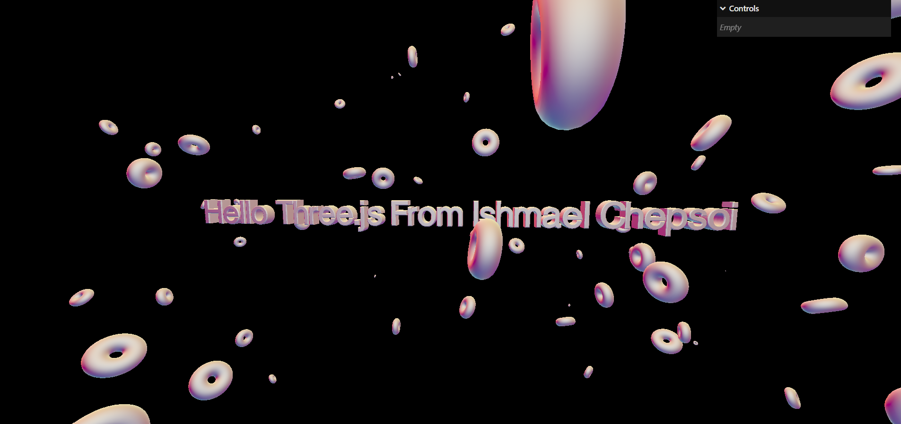

# Three.js Journey

## Setup

Download [Node.js](https://nodejs.org/en/download/).
Run this followed commands:

```bash
# Install dependencies (only the first time)
npm install

# Run the local server at localhost:8080
npm run dev

# Build for production in the dist/ directory
npm run build
```

<!-- Adding image of how the text will look like -->

# Reason and outcome

Here is the sample of assignment



## Deploying to Vercel

You can deploy this Vite-built static site to Vercel using either the Vercel dashboard or the Vercel CLI.

1. Vercel dashboard (recommended)

- Push your repository to GitHub/GitLab/Bitbucket.
- In the Vercel dashboard, click "New Project" and import your repository.
- For the Framework Preset, choose "Other" or "Vite". Build command: `yarn build` or `npm run build`. Output directory: `dist`.
- Deploy. Vercel will run the build and serve the `dist/` directory.

2. Vercel CLI

- Install the Vercel CLI: `npm i -g vercel`.
- From the project root run:

```bash
# (one-time) login
vercel login

# Deploy interactively
vercel --prod
```

This project includes a `vercel.json` which configures Vercel to use a static build and output the `dist` folder.

Notes:

- If you use Yarn, Vercel will detect it and use `yarn build`. Ensure `yarn.lock` is committed if you prefer Yarn.
- If you keep `fonts/` and `static/textures/` tracked, remove them from `.vercelignore`.
